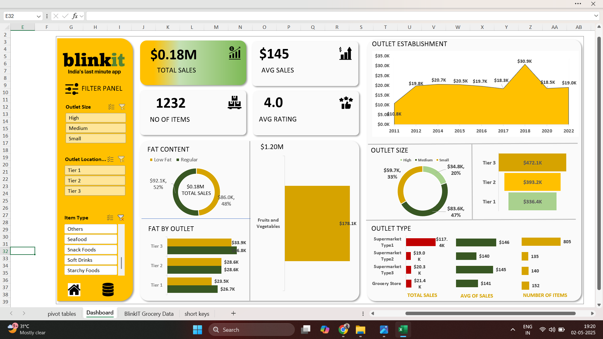

#  BlinkIT Grocery Data Analysis Dashboard

An interactive Excel dashboard built to analyze grocery sales data from BlinkIT. This project showcases data cleaning, pivot table analysis, and visualization techniques using Microsoft Excel.

---

##  Project Objective

To analyze and visualize BlinkIT's grocery sales data to gain insights into product performance, outlet efficiency, and customer behavior using Excel-based dashboard tools.

---

##  Key Features

-  Clean and structured dataset for analysis
-  Pivot tables summarizing sales, item types, ratings, and outlet details
-  Key Performance Indicators (KPIs) like Total Sales, Visibility, and Ratings
- Interactive Dashboard with slicers for:
  - Item Type
  - Outlet Type
  - Tier Classification
-  Visualizations: Bar Charts, Pie Charts, Line Charts, and KPI Cards

---

##  Insights Derived

-  Identified best- and worst-performing product categories
-  Higher sales recorded in Tier-1 outlet regions
- Positive correlation between product ratings and total sales
- Low visibility items contributed less to overall revenue

---

##  Tools Used

- Microsoft Excel
  - Pivot Tables
  - Slicers & Timeline Filters
  - Conditional Formatting
  - Charts (Bar, Line, Pie)
- Data Cleaning & Preprocessing in Excel

---

##  Files Included

- `BlinkIT_Grocery_Dashboard.xlsx` – Main file with raw data, pivot tables, and dashboard
- `Dashboard.png` – Image preview of the dashboard
- `README.md` – Project overview

---

##  How to Use

1. Open `BlinkIT_Grocery_Dashboard.xlsx` in Microsoft Excel.
2. Use the slicers to filter data by product type, outlet type, or tier.
3. Explore the visual trends and KPIs in the Dashboard sheet.

---

---

